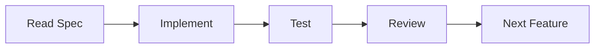

# Quick Start Guide - Evolution of Todo Phase I

> Get started with the Phase I Constitution project in minutes!

## 📋 What You Have

Your Phase I Constitution is now complete with:
- ✅ Project structure created
- ✅ Configuration files ready
- ✅ Complete specifications for all 5 features
- ✅ Development guidelines documented
- ✅ AI assistant instructions prepared

## 🗂️ Project Structure

```
hackathon-2-phase-1/
├── .spec-kit/
│   └── config.yaml              # ✅ Project configuration
├── specs/
│   ├── add-todo.md              # ✅ Complete spec
│   ├── view-todos.md            # ✅ Complete spec
│   ├── update-todo.md           # ✅ Complete spec
│   ├── delete-todo.md           # ✅ Complete spec
│   ├── mark-complete.md         # ✅ Complete spec
│   └── SPEC_TEMPLATE.md         # Template for future specs
├── src/                         # 🔜 Ready for implementation
├── .gitignore                   # ✅ Git ignore rules
├── CLAUDE.md                    # ✅ AI assistant instructions
├── README.md                    # ✅ Project documentation
├── QUICKSTART.md                # ✅ This file
└── pyproject.toml               # ✅ UV configuration
```

## 🚀 Next Steps

### Step 1: Initialize UV Environment
```bash
# Make sure you're in the project directory
cd hackathon-2-phase-1

# Initialize UV (if not already done)
uv init

# Sync dependencies
uv sync
```

### Step 2: Review Specifications
Read through the specifications in the `specs/` folder:
1. **specs/add-todo.md** - Start here (first feature)
2. **specs/view-todos.md** - Second feature
3. **specs/update-todo.md** - Third feature
4. **specs/delete-todo.md** - Fourth feature
5. **specs/mark-complete.md** - Fifth feature

### Step 3: Begin Implementation
Follow the Spec-Driven Development process:



**Recommended Order:**
1. Create `src/models.py` (Todo data model)
2. Create `src/todo_manager.py` (Business logic)
3. Create `src/ui.py` (Console interface)
4. Create `src/main.py` (Entry point)

### Step 4: Implement Features One by One
```bash
# Feature 1: Add Todo
1. Read specs/add-todo.md completely
2. Implement in src/todo_manager.py and src/ui.py
3. Test manually via console
4. Review against spec

# Feature 2: View Todos
[Repeat process]

# Continue for all 5 features...
```

## 📚 Key Documents

### For Development
- **CLAUDE.md** - Complete development guide for AI assistant
- **.spec-kit/config.yaml** - Project configuration and guidelines
- **specs/*.md** - Feature specifications

### For Reference
- **README.md** - Project overview and documentation
- **SPEC_TEMPLATE.md** - Template for future specifications

## 🎯 Development Workflow

### The Spec-Driven Process

```
┌─────────────────────────────────────────┐
│ 1. READ SPECIFICATION                   │
│    • Understand requirements            │
│    • Note acceptance criteria           │
│    • Review edge cases                  │
└─────────────────────────────────────────┘
              ↓
┌─────────────────────────────────────────┐
│ 2. IMPLEMENT FEATURE                    │
│    • Follow spec exactly                │
│    • Use type hints                     │
│    • Handle all errors                  │
│    • Separate concerns (UI/Logic/Data)  │
└─────────────────────────────────────────┘
              ↓
┌─────────────────────────────────────────┐
│ 3. TEST MANUALLY                        │
│    • Test happy path                    │
│    • Test edge cases                    │
│    • Test error handling                │
│    • Verify output format               │
└─────────────────────────────────────────┘
              ↓
┌─────────────────────────────────────────┐
│ 4. REVIEW AGAINST SPEC                  │
│    • Check acceptance criteria          │
│    • Verify all edge cases handled      │
│    • Confirm error messages match       │
│    • Validate code quality              │
└─────────────────────────────────────────┘
              ↓
┌─────────────────────────────────────────┐
│ 5. MOVE TO NEXT FEATURE                 │
└─────────────────────────────────────────┘
```

## 💻 Implementation Tips

### Project Structure Best Practices

**src/models.py** - Data Model
```python
from dataclasses import dataclass, field
from datetime import datetime

@dataclass
class Todo:
    id: int
    title: str
    completed: bool = False
    created_at: datetime = field(default_factory=datetime.now)
```

**src/todo_manager.py** - Business Logic
```python
# CRUD operations
# No UI code here
# Pure business logic
```

**src/ui.py** - Console Interface
```python
# Display functions
# Input handling
# Menu system
# No business logic here
```

**src/main.py** - Entry Point
```python
# Application startup
# Main loop
# Coordinate UI and business logic
```

### Code Quality Checklist
- ✅ Type hints on all functions
- ✅ Docstrings for all functions
- ✅ PEP 8 compliant (check with `uv run ruff check`)
- ✅ Error handling for all user inputs
- ✅ Clear, descriptive variable names
- ✅ Small, focused functions
- ✅ Separation of concerns

## 🎓 Using the AI Assistant (Claude)

Claude has been provided with complete instructions in `CLAUDE.md`. You can:

### Ask for Implementation Help
```
"Claude, please implement the Add Todo feature according to specs/add-todo.md"
```

### Ask for Code Review
```
"Claude, please review my implementation against specs/add-todo.md"
```

### Ask for Clarification
```
"Claude, how should I handle [specific scenario] based on the spec?"
```

### Ask for Architecture Guidance
```
"Claude, how should I structure the src/ folder for this project?"
```

## 🔍 Validation Checklist

### Before Marking Feature Complete
- [ ] Read specification completely
- [ ] All acceptance criteria met
- [ ] All edge cases handled
- [ ] Error messages match spec
- [ ] Output format matches spec
- [ ] Code has type hints
- [ ] Code is documented
- [ ] Manual testing completed
- [ ] Code reviewed

### Before Moving to Next Feature
- [ ] Current feature fully implemented
- [ ] No known bugs
- [ ] Code is clean and maintainable
- [ ] Feature works as specified
- [ ] Ready to build on this foundation

## 📊 Phase I Feature Checklist

Track your progress:

- [ ] **Feature 1: Add Todo** (specs/add-todo.md)
  - [ ] Spec reviewed
  - [ ] Implemented
  - [ ] Tested
  - [ ] Complete

- [ ] **Feature 2: View Todos** (specs/view-todos.md)
  - [ ] Spec reviewed
  - [ ] Implemented
  - [ ] Tested
  - [ ] Complete

- [ ] **Feature 3: Update Todo** (specs/update-todo.md)
  - [ ] Spec reviewed
  - [ ] Implemented
  - [ ] Tested
  - [ ] Complete

- [ ] **Feature 4: Delete Todo** (specs/delete-todo.md)
  - [ ] Spec reviewed
  - [ ] Implemented
  - [ ] Tested
  - [ ] Complete

- [ ] **Feature 5: Mark Complete** (specs/mark-complete.md)
  - [ ] Spec reviewed
  - [ ] Implemented
  - [ ] Tested
  - [ ] Complete

## 🎉 When All Features Are Complete

You will have:
- ✅ Fully functional console todo app
- ✅ Clean, maintainable codebase
- ✅ Solid foundation for Phase II
- ✅ Experience with spec-driven development

## 🚀 Running the Application

Once implemented:
```bash
# Run the app
uv run python src/main.py

# Or activate venv and run
source .venv/bin/activate  # Windows: .venv\Scripts\activate
python src/main.py
```

Expected output:
```
=== Todo List Manager ===
1. Add Todo
2. View Todos
3. Update Todo
4. Delete Todo
5. Mark Complete/Incomplete
6. Exit

Enter your choice (1-6):
```

## 📚 Additional Resources

### Configuration Reference
- **.spec-kit/config.yaml** - Full project configuration

### Development Guidelines
- **CLAUDE.md** - Complete development guide

### Code Style
```bash
# Check code style
uv run ruff check src/

# Format code
uv run ruff format src/
```

## 🤝 Working with AI Assistant

The `CLAUDE.md` file contains:
- Complete project context
- Development workflow
- Coding standards
- Subagent roles
- Implementation guidelines

Claude is configured to:
1. Follow spec-driven methodology
2. Maintain code quality
3. Implement features incrementally
4. Review code against specs
5. Handle edge cases properly

## 🎯 Success Criteria for Phase I

Phase I is complete when:
- ✅ All 5 features implemented
- ✅ All specs satisfied
- ✅ No crashes or unhandled errors
- ✅ Clean, maintainable code
- ✅ Good user experience
- ✅ Ready for Phase II (file persistence)

## 💡 Tips for Success

1. **Read specs thoroughly** before implementing
2. **One feature at a time** - don't mix features
3. **Test as you go** - don't wait until the end
4. **Keep it simple** - no over-engineering
5. **Follow the structure** - UI, Logic, Data separation
6. **Handle errors gracefully** - never crash
7. **Use type hints** - makes code clearer
8. **Document your code** - future you will thank you

## 🎓 Learning Outcomes

By completing Phase I, you'll learn:
- Spec-driven development methodology
- Clean architecture principles
- Python best practices
- Error handling strategies
- User experience design
- Incremental development

## 📞 Need Help?

1. **Read CLAUDE.md** - Comprehensive guide
2. **Review specs** - All details are there
3. **Check config.yaml** - Project guidelines
4. **Ask Claude** - AI assistant is here to help

## 🎉 Ready to Build!

You have everything you need:
- ✅ Clear specifications
- ✅ Project structure
- ✅ Development guidelines
- ✅ AI assistant support

**Let's build something great! 🚀**

---

**Remember: Specification → Implementation → Testing → Review → Next Feature**

Good luck with Phase I! 🎯
