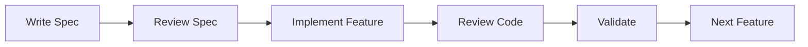

# Evolution of Todo - Phase I

> A Spec-Driven Python Console Application built with Spec-Kit Plus Principles

## 📋 Project Overview

**Evolution of Todo** is a multi-phase project that demonstrates professional software development methodology through building a todo list application that evolves from a simple console app to a full-featured web application.

**Current Phase:** Phase I - Python Console Application with In-Memory Storage

## 🎯 Phase I Goals

Build a solid foundation with:
- ✅ Spec-driven development methodology
- ✅ Clean, maintainable Python code
- ✅ Complete CRUD operations for todos
- ✅ User-friendly console interface
- ✅ Robust error handling

## 🛠️ Technology Stack

- **Language:** Python 3.13+
- **Package Manager:** UV (modern Python package manager)
- **Storage:** In-memory (Python list)
- **Interface:** Console (menu-driven)
- **Architecture:** Layered (UI, Business Logic, Data Model)

## 🏗️ Project Structure

```
hackathon-2-phase-1/
├── .spec-kit/
│   └── config.yaml          # Project configuration & feature definitions
├── specs/
│   ├── add-todo.md          # Specification: Adding todos
│   ├── view-todos.md        # Specification: Viewing todos
│   ├── update-todo.md       # Specification: Updating todos
│   ├── delete-todo.md       # Specification: Deleting todos
│   └── mark-complete.md     # Specification: Marking complete
├── src/
│   ├── main.py              # Application entry point
│   ├── todo_manager.py      # Business logic & CRUD operations
│   ├── ui.py                # Console UI layer
│   └── models.py            # Data models (Todo class)
├── CLAUDE.md                # AI Assistant instructions
├── README.md                # This file
└── pyproject.toml           # UV project configuration
```

## ✨ Features (Phase I)

### Core Operations
1. **Add Todo** - Create new todo items with titles
2. **View Todos** - Display all todos with status and timestamps
3. **Update Todo** - Modify existing todo item details
4. **Delete Todo** - Remove todos from the list
5. **Mark Complete** - Toggle completion status

### User Experience
- Simple, intuitive menu-driven interface
- Clear feedback for all operations
- Input validation and error handling
- Visual status indicators (✓ for complete, ✗ for pending)
- Timestamps for todo creation

## 🚀 Getting Started

### Prerequisites
- Python 3.13 or higher
- UV package manager

### Installation

#### Option 1: Automatic Setup (Recommended) ⚡

**Linux / macOS / WSL:**
```bash
cd hackathon-2-phase-1
./setup_uv.sh
```

**Windows:**
```bash
cd hackathon-2-phase-1
setup_uv.bat
```

This will automatically:
- Install UV (if not present)
- Create virtual environment
- Install all dependencies
- Verify installation

#### Option 2: Manual Setup

1. **Install UV** (if not already installed)
   ```bash
   # macOS/Linux/WSL
   curl -LsSf https://astral.sh/uv/install.sh | sh

   # Windows (PowerShell)
   powershell -c "irm https://astral.sh/uv/install.ps1 | iex"
   ```

2. **Setup the project**
   ```bash
   cd hackathon-2-phase-1

   # Create virtual environment
   uv venv

   # Install project with dependencies
   uv pip install -e ".[dev]"
   ```

### Running the Application

#### With UV (Recommended - No activation needed) ⚡
```bash
# Run directly with UV
uv run python src/main.py
```

#### With Activated Environment
```bash
# Activate environment first
source .venv/bin/activate  # Linux/macOS/WSL
# or
.venv\Scripts\activate     # Windows

# Then run
python src/main.py
```

## 📖 Usage Example

```
=== Todo List Manager ===
1. Add Todo
2. View Todos
3. Update Todo
4. Delete Todo
5. Mark Complete/Incomplete
6. Exit

Enter your choice (1-6): 1
Enter todo title: Buy groceries
✓ Todo added successfully!

Enter your choice (1-6): 2

=== Your Todos ===
1. [ ] Buy groceries (Created: 2025-01-10 14:30)

Total: 1 todos (0 completed, 1 pending)
```

## 🎨 Development Methodology

### Spec-Kit Plus Principles

This project follows **Spec-Driven Development**:

1. **Specification First** - Every feature starts with a detailed spec
2. **Incremental Development** - Build one feature at a time
3. **Minimal Viable** - Implement only what's needed
4. **Clear Separation** - UI, logic, and data are separated
5. **Quality Focus** - Clean code, error handling, good UX

### Development Workflow



## 📁 Key Files

### Configuration
- **`.spec-kit/config.yaml`** - Project configuration, features, and guidelines
- **`CLAUDE.md`** - Instructions for AI assistant development

### Specifications
- **`specs/*.md`** - Detailed feature specifications with acceptance criteria

### Source Code
- **`src/models.py`** - Todo data model (dataclass)
- **`src/todo_manager.py`** - Business logic (CRUD operations)
- **`src/ui.py`** - Console interface (menu, display, input)
- **`src/main.py`** - Application entry point and main loop

## 🔍 Code Quality Standards

- ✅ PEP 8 compliant
- ✅ Type hints throughout
- ✅ Comprehensive error handling
- ✅ Clear function documentation
- ✅ Separation of concerns
- ✅ No code duplication

## 🧪 Validation

Phase I uses **manual validation** through console interaction:
- Test each feature thoroughly
- Verify edge cases
- Ensure error handling works
- Validate user experience

## 🛣️ Roadmap

### Phase I (Current) - Console Application ✅
- In-memory storage
- Core CRUD operations
- Console interface

### Phase II (Next) - File Persistence
- JSON/CSV file storage
- Load/save on startup/shutdown
- Data persistence between sessions

### Phase III (Future) - Database
- SQLite integration
- Advanced fields (priority, due date, tags)
- Query and filter capabilities

### Phase IV (Future) - Web API
- FastAPI backend
- RESTful endpoints
- Web and console clients

## 📚 Documentation

- **CLAUDE.md** - Complete AI assistant guide
- **specs/** - Feature specifications
- **.spec-kit/config.yaml** - Project configuration reference

## 🤝 Contributing

This project follows strict specification-driven development:

1. Create/update specification in `specs/`
2. Get specification approved
3. Implement according to spec
4. Review code against spec
5. Validate functionality

## 📝 License

This is an educational project for demonstration purposes.

## 🎓 Learning Outcomes

This project demonstrates:
- Spec-driven development methodology
- Clean architecture principles
- Python best practices
- Error handling and validation
- User experience design
- Incremental development approach

## 📞 Support

For questions or issues:
1. Review `CLAUDE.md` for development guidance
2. Check `.spec-kit/config.yaml` for configuration
3. Read feature specs in `specs/` folder

## 🏆 Project Status

**Phase:** I - Foundation
**Status:** Specification Phase - Ready for Implementation
**Next:** Create feature specifications and implement

---

## Quick Start Commands

```bash
# Install dependencies
uv sync

# Run the application
uv run python src/main.py

# Check code style
uv run ruff check src/

# Format code
uv run ruff format src/
```

---

**Built with Spec-Kit Plus Methodology**

*Remember: Specification → Implementation → Review → Success*
